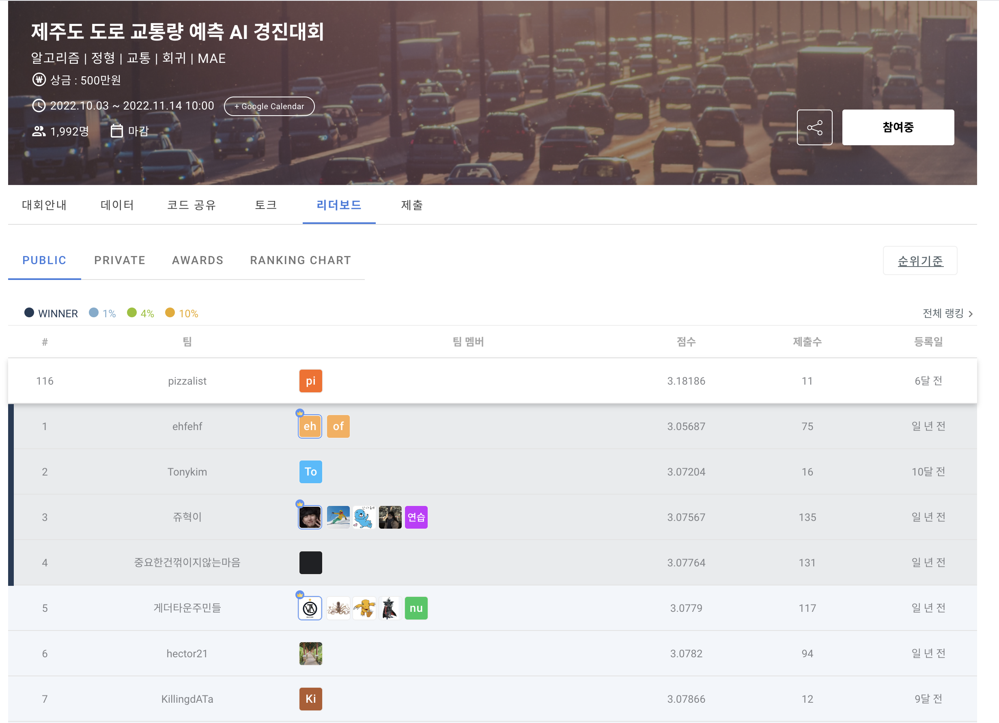

# 제주도 도로 교통량 예측 AI 
- [ML study](./ml-study)를 마친 뒤, 실제 데이콘 경진대회 데이터를 활용하여 제주도 도로 교통량을 예측하고 리포트를 바탕으로 세미나를 진행한 프로젝트이다.

### 프로젝트 세부사항 및 세미나 영상
[Jeju Traffic Prediction Notion Page](https://pepper-origami-952.notion.site/ML-jeju-traffic-prediction-75c0758007624c64bceccb2aa6cbbcb5?pvs=4)

> ### 배경 
제주도내 주민등록인구는 2022년 기준 약 68만명으로, 연평균 1.3%정도 매년 증가하고 있습니다.

또한 외국인과 관광객까지 고려하면 전체 상주인구는 90만명을 넘을 것으로 추정되며, 

제주도민 증가와 외국인의 증가로 현재 제주도의 교통체증이 심각한 문제로 떠오르고 있습니다.

> ### 주제
제주도 도로 교통량 예측 AI 알고리즘 개발

> ### 설명
제주도의 교통 정보로부터 도로 교통량 회귀 예측

> ### 주최 / 주관
주최: 제주 테크노파크, 제주특별자치도
주관: 데이콘

> ### 참가자격
일반인, 학생 등 누구나

> ### 평가 산식
MAE

> ### data
[데이콘 제주도 도로 교통량 예측 AI 경진대회](https://dacon.io/competitions/official/235985/overview/description)

## 리포트 코드
[jeju_traffic_prediction.ipynb](./jeju-traffic-prediction/jeju_traffic_prediction.ipynb)

## 데이콘 리더보드 제출 해보기
- 점수: 3.18186 (pizzalist)
